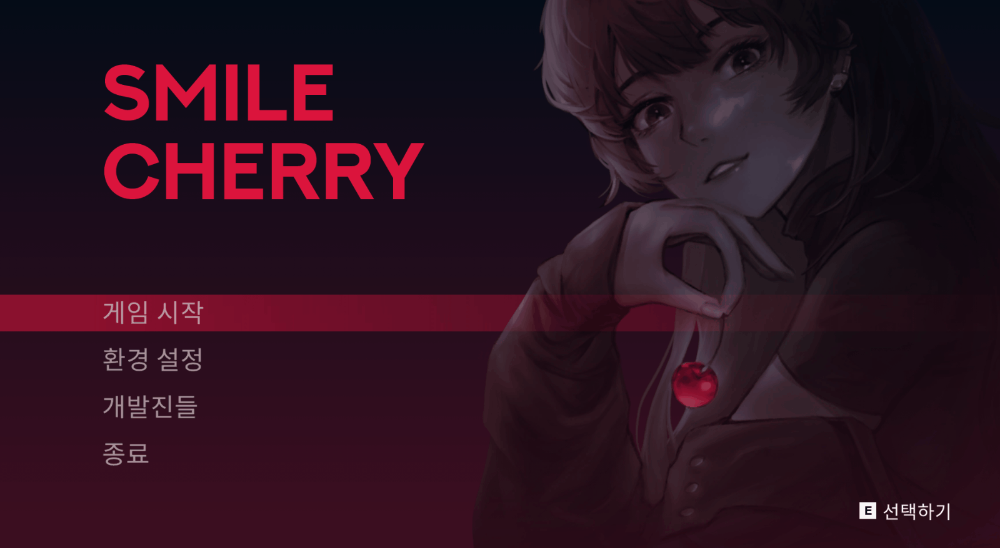

# Project-SmileCherry
SGM-14 Project

스마일 체리 프로젝트   

전 스마일체리 업그레이드 프로젝트 [전 체리 프로젝트](https://fkdl0048.github.io/game/game_4/)  

게임명: SmileCherry  
장르: 2D 액션 플랫포머  
플랫폼: PC  
개발엔진: Unity  
소개: ‘스마일 체리’는 창작스토리 기반 2D 액션 플랫포머 게임입니다. 시민이 세 계급으로 분화되는 디스토피아 사회. 사이보그 헥터는 친구를 구하기 위해 여정을 떠나게 됩니다. 아이템 증강체를 통한 스킬 커스터마이징, 기계화에 따른 외형 및 능력 변화, 분기점 선택에 따른 멀티 엔딩까지! 헥터가 되어 자살폭탄 테러조직의 실마리를 찾아 친구 체리를 구해보세요  

다운로드 링크: [구글 드라이브 링크](https://drive.google.com/file/d/1yDAnVgm8ulHSOpxwL1kC5CWFuD1EQWMG/view?usp=share_link)  

전 프로젝트와 차이점: 스파인 애니메이션 도입, 액션성 업그레이드, 캐릭터 성격 및 스토리 구체화, 배경 및 오브젝트 전체 제작  

  

   

  

  

    